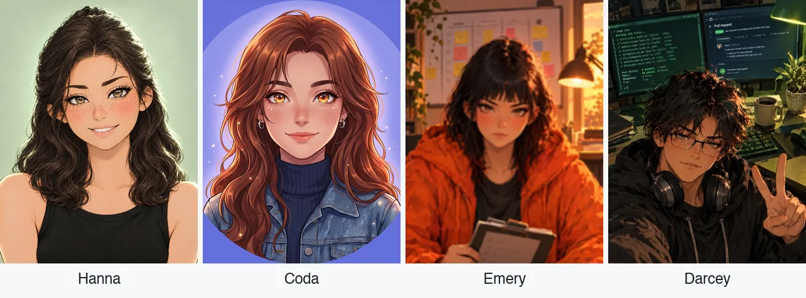

<h1 align="center">Sage Advice</h1>

<b>May we offer you some sage advice?</b>

## The team

Hanna, Coda, Pixel, Emery and Darcey.

## The crew

Dashed boxes are roles that are planned and not built yet.

## Departments

## Open source

